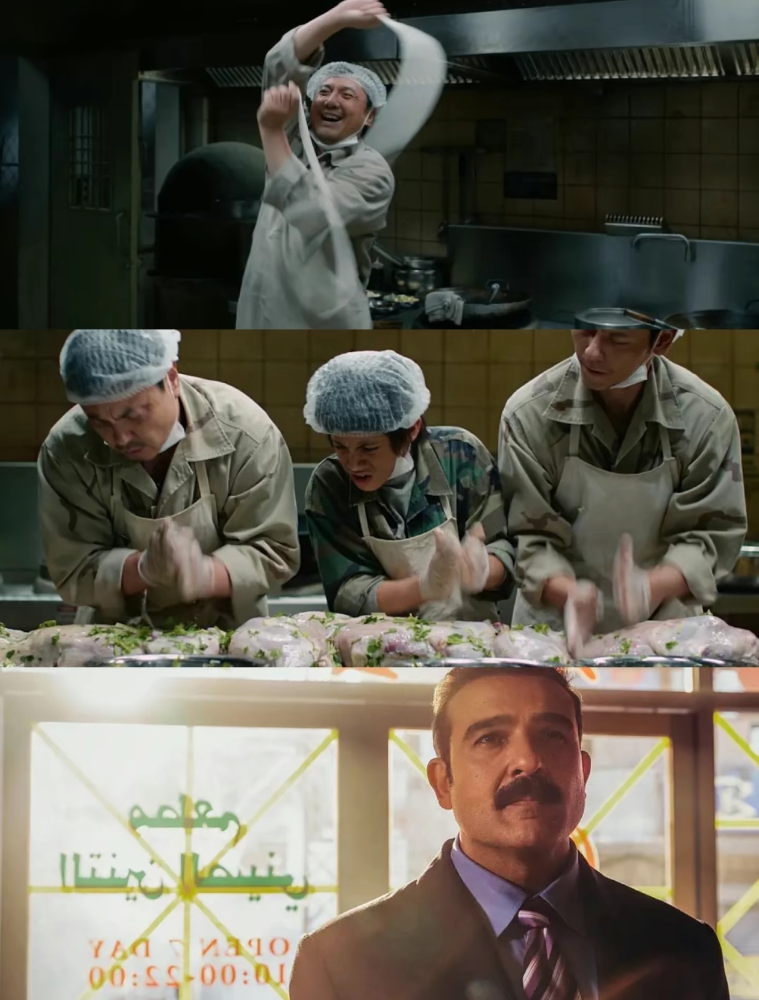

最近看了两部电影，一部是漫威的“蜘蛛侠四”，一部是“欢迎来到龙餐馆”。

:::note[蜘蛛侠]
这部电影在我看来真的没什么意思，剧情基本都能从头猜到尾，漫威的电影真的是一年比一年无聊。小时候憧憬成为Superhero，长大后觉得这种电影越来越没意思，小时候的那批超级英雄也基本都在荧幕前落幕了。
:::

:::note[欢迎来到龙餐馆]
开始以为是一部喜剧片，但越往后看越动情，每个人在战争面前都会变得很无力，也有可能会被战争扭曲人性，战争中人性的光辉与贪婪也可以存在于一个人身上，而对于战争中的小孩来讲真的是无妄之灾。
:::

## 现在的社交软件真的鱼龙混杂

我在社交软件上发布了一篇帖子，内容是对于我而言，蜘蛛侠没有龙餐馆好看。

结果就是被很多漫威小子当作冲锋地了，有很多漫威小子都在喷我说谁会去电影院看“喜剧片”，我才真实的体会到有些人甚至不愿意去了解一部电影就在网络上随意攻击，更有甚者攻击我拉踩两部电影，我在帖子里面已经说过是从我的视角来看，真的有点无语。

当电影成为宗教，当普通人没有表现自己想法的权力，再具有艺术性的电影也只是一部索然无味的长视频。

如今漫威小子给我的感觉有点像足球界的骡结晶和梅孝子。最后我的帖子也因为这些人的冲锋而被封禁。

有句话说的很好，网上5%的人占据了95%的发声地，忽然对这句话有了具象的理解。

